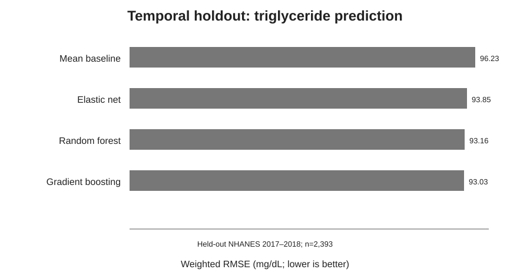
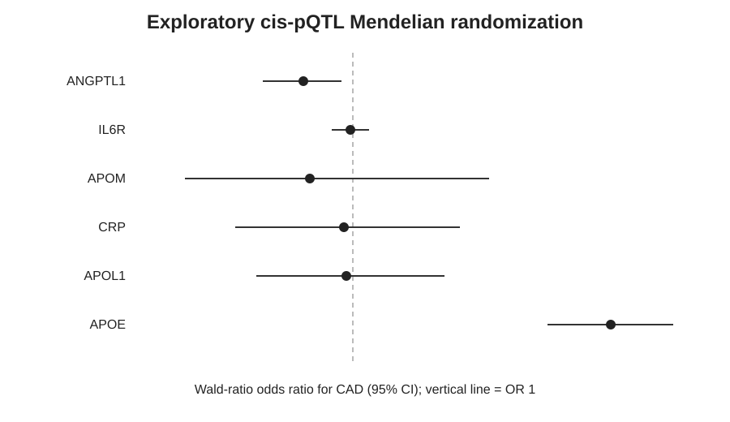
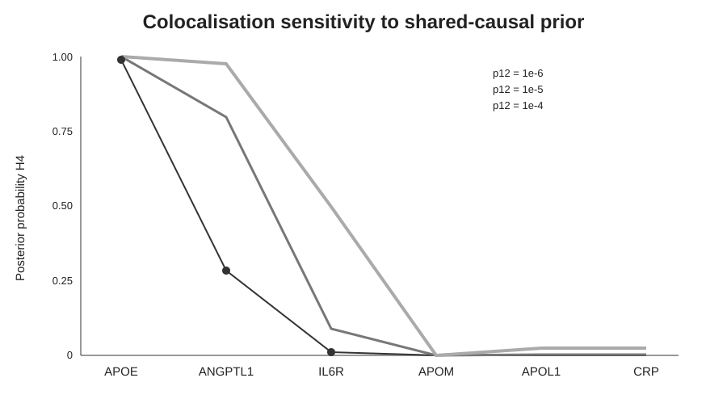
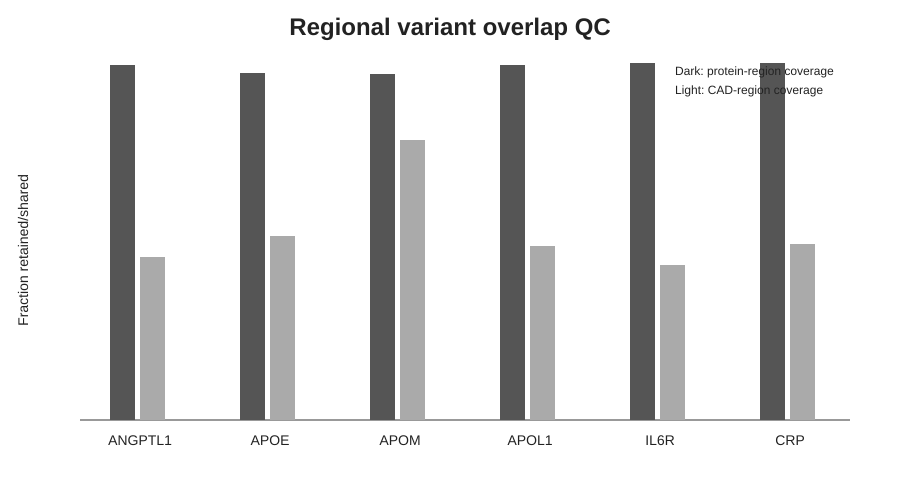
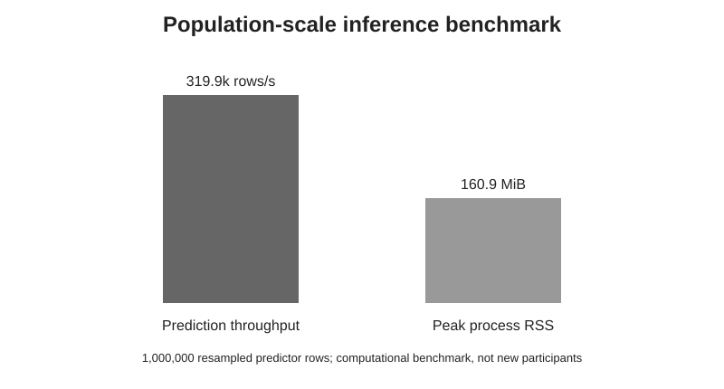

# CardioBridge

Reproducible public-data cardiometabolic research prototype. Version 0.3.

CardioBridge demonstrates a compact population-health genomics workflow spanning **phenotypic prediction, GWAS/pQTL integration, Mendelian randomization, regional colocalisation, pathway annotation, polygenic-score implementation, and population-scale computational benchmarking**.

## Completed analyses

- Triglyceride model benchmark in 7,200 NHANES adults, including 2,393 temporally held-out participants.
- Cis-pQTL single-variant MR for six proteins using INTERVAL and CAD GWAS summary statistics.
- Regional ABF colocalisation and prior sensitivity for all six proteins.
- Reactome annotation through UniProt cross-references.
- Batched inference on one million resampled rows (computational test, not one million new participants).
- Reproducible CAD PGS implementation using PGS012581 / PRS169_CAD from the PGS Catalog.
- Clinical-utility evaluation framework comparing clinical risk, PGS, and clinical + PGS using discrimination, calibration, reclassification and decision-curve analysis.

The strongest shared regional signal in the current colocalisation analysis is APOE. ANGPTL1 is prior-sensitive. IL6R's MR association is not supported by strong colocalisation under the single-signal model used here. These findings are exploratory, not validated causal mechanisms or treatment recommendations.

## Polygenic-score module

`pgs/run_pgs.py` downloads the official PGS012581 scoring file and implements effect-allele harmonisation and weighted score calculation for a compatible individual-level genotype dosage table. CardioBridge does **not** currently contain an independent genotype cohort with CAD outcomes, so no independent PGS performance or clinical-validation claim is made. See `pgs/README.md`.

## Run

Install `requirements.txt` and follow the module documentation. Python scripts fetch public source files. Run `run_analysis.py` before `run_scalability.py`. Run `genetics/run_genetics.py` before the other genetics scripts.

## Repository contents

- `run_analysis.py`: NHANES prediction benchmark.
- `run_scalability.py`: one-million-row throughput benchmark.
- `genetics/run_genetics.py`: data retrieval, QC, allele matching and MR.
- `genetics/remote_tabix.py`: indexed public GWAS region retrieval.
- `genetics/run_colocalisation.py`: ABF colocalisation with prior sensitivity.
- `genetics/run_pathways.py`: Reactome cross-reference annotation.
- `genetics/verify_results.py`: source and numerical consistency checks.
- `pgs/run_pgs.py`: published CAD polygenic-score acquisition, harmonisation and calculation.
- `clinical_utility/evaluate_clinical_utility.py`: independent-cohort incremental-value and decision-curve evaluation framework.
- `outputs/`, `genetics/outputs/`, `pgs/outputs/`: analysis outputs and provenance.

## Key figures

### Temporal holdout prediction

### Exploratory cis-pQTL Mendelian randomization

### Colocalisation sensitivity

### Regional variant-overlap QC

### Population-scale computational benchmark

These figures are generated from the recorded CardioBridge outputs. No clinical-utility curve is shown because an appropriate linked individual-level genotype + CAD validation cohort has not yet been analysed.

## Scope and limitations

Downloaded raw data and caches are excluded. The analyses use public/de-identified or summary-level resources. CardioBridge does not create a new GWAS, link NHANES participants to genetic participants, or provide matched individual-level multi-omics. The current PGS component implements a published score but does not independently validate it in a genotype-plus-CAD cohort. A clinical-utility evaluation framework is implemented, but its patient-level analysis remains pending an appropriate linked validation cohort. The project does not currently establish clinical utility.

This is an independent portfolio project.
